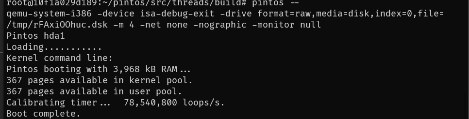

# Project 0: Getting Real

## Preliminaries

>Fill in your name and email address.

FirstName LastName <email@domain.example>

>If you have any preliminary comments on your submission, notes for the TAs, please give them here.

>Please cite any offline or online sources you consulted while preparing your submission, other than the Pintos documentation, course text, lecture notes, and course staff.

## Booting Pintos

>A1: Put the screenshot of Pintos running example here.

## Debugging

#### QUESTIONS: BIOS 

>B1: What is the first instruction that gets executed?

>B2: At which physical address is this instruction located?

#### QUESTIONS: BOOTLOADER

>B3: How does the bootloader read disk sectors? In particular, what BIOS interrupt is used?

int 0x13

>B4: How does the bootloader decides whether it successfully finds the Pintos kernel?

读hard disk 的 partiton table。找到一个 partition type 为 0x20，指示这是一个 pintos kernel。再检查是否是可引导分区（0x80）

>B5: What happens when the bootloader could not find the Pintos kernel?

触发 int 0x18 中断

>B6: At what point and how exactly does the bootloader transfer control to the Pintos kernel?

loader 需要先在 0x20000 处加载 kernel 代码，512kb，即1024个扇区，然后跳转到 0x20000处执行kernel代码。

#### QUESTIONS: KERNEL

>B7: At the entry of pintos_init(), what is the value of expression `init_page_dir[pd_no(ptov(0))]` in hexadecimal format?

0x0

>B8: When `palloc_get_page()` is called for the first time,

>> B8.1 what does the call stack look like?
>>
>> 

>> B8.2 what is the return value in hexadecimal format?
>>
>> 0xc0101000 (physical addr)

>> B8.3 what is the value of expression `init_page_dir[pd_no(ptov(0))]` in hexadecimal format?
>>
>> 0x0, 还没映射呢。第一个page 是给 page dir 分配的

>B9: When palloc_get_page() is called for the third time,

>> B9.1 what does the call stack look like?
>>
>> 

>> B9.2 what is the return value in hexadecimal format?
>>
>> 0x c0103000

>> B9.3 what is the value of expression `init_page_dir[pd_no(ptov(0))]` in hexadecimal format?
>>
>> 0x102027 page table 的物理地址，后面几位是标志位，需要做mask

## Kernel Monitor

>C1: Put the screenshot of your kernel monitor running example here. (It should show how your kernel shell respond to `whoami`, `exit`, and `other input`.)

#### 

>C2: Explain how you read and write to the console for the kernel monitor.
